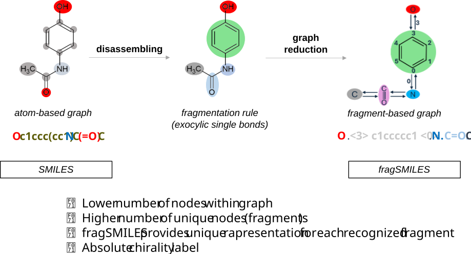
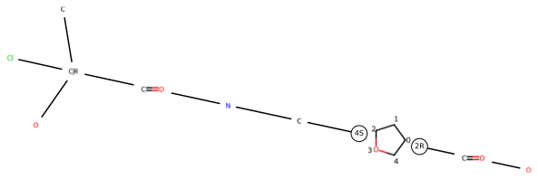

<h1 align="center">  Graph of Frags - chemicalGoF tool repository </h1>
<h4 align="center">  Molecular Graph Reduction algorithm for fragSMILES notation </h1>

<div align="center">
    
</div>

[](https://github.com/f48r1/chemicalgof/actions/workflows/python-package.yml)
<!-- [](https://pypi.org/project/chemicalgof/) -->
[](https://www.python.org/)
[](https://opensource.org/licenses/MIT)
[](https://doi.org/10.5281/zenodo.12700298)
[](https://www.rdkit.org/)
[](https://networkx.org/)

> **_NOTE:_**  This package has been refactored and the current version is 0.3.0.dev; Deprecated warnings are implemented.

- [Introduction](#introduction)
- [🔧 Installation](#-installation)
  - [1. (Optional but recommended) Create a virtual environment](#1-optional-but-recommended-create-a-virtual-environment)
    - [🔹 Using Python `venv`](#-using-python-venv)
    - [🔹 Using Conda](#-using-conda)
  - [2a. 🔨 Install from source](#2a--install-from-source)
  - [2b. 📦 Install directly via `pip`](#2b--install-directly-via-pip)
- [How to use](#how-to-use)
- [Notebooks](#notebooks)
- [Reference](#reference)

# Introduction

Welcome to the `chemicalgof` repository! Graph of Frag (GoF) tool is designed to provide the graph reduction process to convert molecules atom-based to the fragment-based one !
Our tool allows to set a custom-user rule for fragment molecules. By default, our fragmentation rule lead to the so called fragSMILES notation.

To do this, you need python interpreter ... and of course your molecules :)

---

# 🔧 Installation

## 1. (Optional but recommended) Create a virtual environment

Using a virtual environment is good practice to isolate dependencies.  
You can use either standard Python tools or Conda, depending on your operating system.

- **For Linux users**: the native Python environment is usually sufficient.  
- **For Windows and macOS users**: we recommend using [Anaconda](https://www.anaconda.com/) for better compatibility.

### 🔹 Using Python `venv`

```bash
python -m venv .venv
source .venv/bin/activate  # On Windows: .venv\Scripts\activate
```

### 🔹 Using Conda

> ⚠️ In the examples below, `gof` is just a placeholder name for your environment—you can choose any name.

```bash
conda create --name gof python=3.13
conda activate gof
```

---

## 2a. 🔨 Install from source

1. Clone the repository to a desired directory (e.g., your home folder):

   ```bash
   git clone --branch 0.3.0 https://github.com/f48r1/chemicalgof.git
   ```

2. Navigate to the project directory:

   ```bash
   cd chemicalgof/
   ```

3. Install the package locally:

   ```bash
   python -m pip install .
   ```

---

## 2b. 📦 Install directly via `pip`

If you prefer a simpler installation, you can install the package directly from GitHub:

```bash
pip install "git+https://github.com/f48r1/chemicalgof.git@0.3.0"
```

# How to use

```python
from chemicalgof import encode

## Example SMILES string of a molecule providing chirality information
smiles = 'C[C@@](O)(Cl)C(=O)NC[C@@H]1CC[C@H](C(=O)O)O1'

## Convert SMILES into relative fragSMILES !
fragsmiles = encode(smiles)

print(fragsmiles)
```

```text
'C.C|R.(O.).(Cl.).C=O.N.C.<4S>C1CCOC1<2R>.C=O.O'
```

Then, to parse a fragSMILES representation, if valid, and convert it into the relative SMILES

```python
from chemicalgof import decode

ret_smiles = decode(fragsmiles)

# and finally SMILES
print(ret_smiles == smiles)
```

```text
True
```

The resulted fragSMILES representation is suitable for a fragment-level tokenization to be employed for Chemical Language Models (CLMs) feeding

```python
from chemicalgof import split_fragsmiles

sequence = split_fragsmiles(fragsmiles)

# and finally SMILES
print(sequence)
```

```text
['C', 'C|R', '(', 'O', ')', '(', 'Cl', ')', 'C=O', 'N', 'C', '<4S>', 'C1CCOC1', '<2R>', 'C=O', 'O']
```

The molecular fragment-based graph (GoF) can be also visualized/represented

```python
from chemicalgof import Reduce2GoF, drawGoF

gof = Reduce2GoF(smiles)

drawGoF(gof, random_seed=0, vert_or_horiz='horiz')
```

<div align="center">
   
</div>

---

# Notebooks

The [`notebooks/`](./notebooks/) directory contains interactive examples and additional experiments illustrating how to work with **chemicalgof** and the **fragSMILES** representation.

The notebooks cover different aspects of the workflow:

- [`01_conversion_examples.ipynb`](./notebooks/01_conversion_examples.ipynb) — introductory examples showing how molecules and SMILES can be converted into **fragSMILES** representations using the reduction process (**reduced graph**) and how augmentation process works.
- [`02_decode_sampled_examples.ipynb`](./notebooks/02_decode_sampled_examples.ipynb) — examples showing how to prepare fragSMILES data as input for a Chemical Language Model (CLM) and how to decode selected generated fragSMILES samples back into SMILES representations.
- [`03_some_warnings.ipynb`](./notebooks/03_some_warnings.ipynb) — examples involving large molecules where the conversion process may produce warnings.
- `test_all_data_multiprocessing.ipynb` — development notebook used to test the conversion workflow on the [provided dataset](./data/test.csv) with multiprocessing and to verify the correct bijectivity of `chemicalgof`.
- `notebook_utils.py` — shared utility functions used by the notebooks.

The notebooks are intended both as examples for interesting users and as a practical reference for exploring the fragSMILES encoding/decoding workflow.

For a quick introduction, start with [**`01_conversion_examples.ipynb`**](./notebooks/01_conversion_examples.ipynb).

---

# Reference

If you think that GoF can be usefull for your project, please cite us :)

GoF tool was first presented on this [scientific work](https://www.nature.com/articles/s42004-025-01423-3).
The resulting fragSMILES notation was used for de novo drug design approaches and compared with traditional notations such as SMILES, SELFIES and t-SMILES.

```bibtex
@article{mastrolorito_fragsmiles_2025,
   title = {{fragSMILES} as a chemical string notation for advanced fragment and chirality representation},
   volume = {8},
   issn = {2399-3669},
   url = {https://doi.org/10.1038/s42004-025-01423-3},
   doi = {10.1038/s42004-025-01423-3},
   number = {1},
   journal = {Communications Chemistry},
   author = {
      Mastrolorito, Fabrizio and
      Ciriaco, Fulvio and
      Togo, Maria Vittoria and
      Gambacorta, Nicola and
      Trisciuzzi, Daniela and
      Altomare, Cosimo Damiano and
      Amoroso, Nicola and
      Grisoni, Francesca and
      Nicolotti, Orazio
   },
   month = jan,
   year = {2025},
   pages = {26},
}
```

It was subsequently used for chemical reaction prediction tasks here as well in this [scientific work](https://pubs.rsc.org/cc/article/61/93/18344/882864).

```bibtex
@article{mastrolorito_deeprxn_2025,
   title = {Enhancing deep chemical reaction prediction with advanced chirality and fragment representation},
   volume = {61},
   url = {https://doi.org/10.1039/d5cc02641e},
   doi = {10.1039/d5cc02641e},
   number = {93},
   journal = {Chem. Commun.},
   publisher = {The Royal Society of Chemistry},
   author = {
      Mastrolorito, Fabrizio and
      Ciriaco, Fulvio and
      Nicolotti, Orazio and
      Grisoni, Francesca
   },
   year = {2025},
   pages = {18344--18347},
}
```
